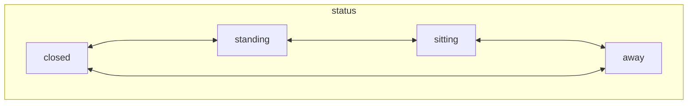
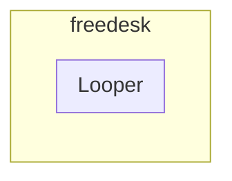
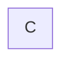

# Freedesk

English | [简体中文](./README.CN.md)

I'd like to have a desk that konws myself and I can talk with.

## Components

- [freedesk-cv](https://github.com/DevecorSoft/freedesk-cv)
- [freedeck-rt](https://github.com/DevecorSoft/freedesk-rt)

## Overview

### APIs

#### APIs from freedesk-rt

- raises
- lowers
- lock
- status
  - on_top
  - on_bottom
- height ?

#### APIs from freedesk-cv

- status
  - closing
  - standing
  - sitting
  - away

### Communication

### Automatic control princple

