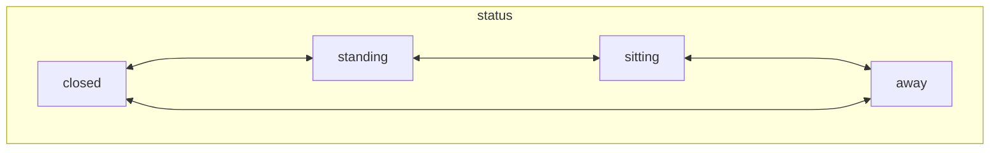
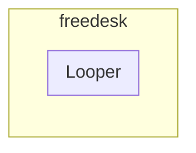
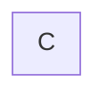

# Freedesk

简体中文 | [English](./README.md)

做一个懂我的桌子

## 组件

- [freedesk-cv](https://github.com/DevecorSoft/freedesk-cv)
- [freedeck-rt](https://github.com/DevecorSoft/freedesk-rt)

## 概述

### 接口设计

#### freedesk-rt

- raises
- lowers
- status
  - on_top
  - on_bottom
- height ?

#### freedesk-cv

- status
  - closing
  - standing
  - sitting
  - away

### Communication

### Automatic control princple

### WIP

- 两张图像间关系：平移还是旋转？
- 随动控制系统
